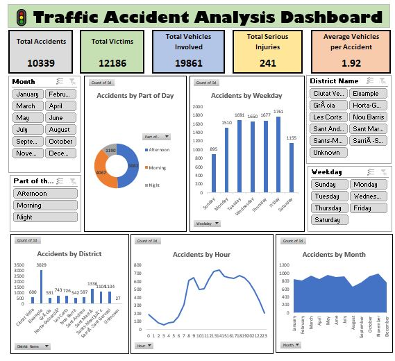
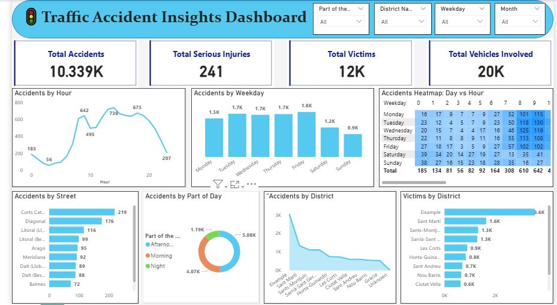
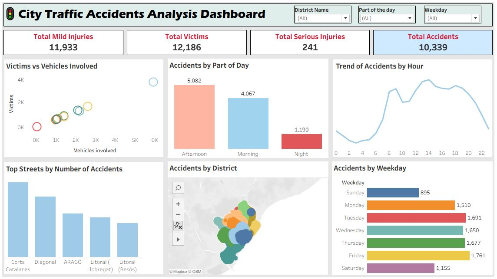

# 🚦 Traffic Accident Analysis Dashboard (Excel, Power BI, Tableau)

An interactive dashboard project that analyzes traffic accident patterns, severity, vehicle involvement, and temporal trends across districts, weekdays, and times of day. This dashboard offers key insights into accident hotspots, peak times, and severity correlations, helping stakeholders and traffic authorities take data-driven safety and operational decisions.

---

## 🛠️ Tools Used

**Excel:** Data cleaning, KPI calculations, pivot charts, structured dashboard creation.  
**Power BI:** Interactive dashboards, slicers, KPI cards, drill-down analysis, DAX measures.  
**Tableau:** Clean, story-driven dashboards with advanced visuals like maps, donut charts, and interactive filtering.

---

## 🔑 Key KPIs Tracked

- Total Accidents
- Total Victims
- Total Vehicles Involved
- Total Serious Injuries
- Average Vehicles per Accident

---

## 🔑 Key Insights

- Identified **peak accident times** during morning and evening rush hours.
- Analyzed **weekday patterns** to identify high-risk days.
- Mapped **accident hotspots** across districts and top streets.
- Visualized **victims vs vehicles involved** for severity analysis.
- Filtered views using **interactive slicers** for district, weekday, month, and part of day.

---

## 🚀 How to View the Dashboard

- Download and open in the respective tools (Excel, Power BI, Tableau).
- Explore filters, slicers, and interactive visuals.
- Review insights to understand traffic patterns and safety trends.

---

## 🖼️ Dashboard Previews

### 📊 Excel Dashboard

📌 Displays KPI cards, bar charts, trend analysis, and slicers for interactive filtering.

---

### 📊 Power BI Dashboard

📌 Includes interactive KPI cards, slicers, drill-down visuals for accidents, victims, and severity analysis.

---

### 📊 Tableau Dashboard

📌 Showcases map-based accident hotspots, donut charts for part-of-day analysis, and interactive trends for temporal accident patterns.

## 👩‍💻 Author

**Name:** Pratiksha Mali  
**LinkedIn:** [linkedin.com/in/pratiksha-mali-b42088221](https://www.linkedin.com/in/pratiksha-mali-b42088221)  
**Email:** [pratiksha.mali2512@gmail.com](mailto:pratiksha.mali2512@gmail.com)  
**Portfolio:** [datascienceportfol.io/pratikshamali2512](https://www.datascienceportfol.io/pratikshamali2512)

---

## 📝 Description

This project was developed as part of my data analytics portfolio to demonstrate **Excel, Power BI, and Tableau dashboarding proficiency** in transforming raw traffic accident data into meaningful, decision-ready insights. The dashboard replicates a real-world traffic monitoring scenario where operational and safety teams can track key metrics, analyze severity patterns, and take targeted, data-driven actions to improve road safety and traffic management strategies.
